# 🌍DevOps Project: Zomato Food Delivery App Deployment 🍔

This DevOps project showcases the deployment of a ZOMATO Clone App leveraging modern DevOps tools and technologies.

---
## 🛠️ Tools & Services Used

---

### 1. Docker Deployment CI/CD-DevOPs Pipeline
These tools are used for building, scanning, and deploying Docker containers on the Ubuntu host.

1. **GitHub**  — Source control  
2. **Jenkins**  — CI/CD server  
3. **Docker & Docker Hub**  — Containerization & image registry  
4. **SonarQube**  — Code quality analysis  
5. **Trivy**  — Container vulnerability scanner  
6. **Docker Scout** — Automated vulnerability scanning integrated with Docker Hub and CLI, helping ensure secure container images  
7. **OWASP Dependency Check**  — Dependency vulnerability scanning  
8. **Gmail SMTP** — Email notifications

---

### 2. Kubernetes Deployment & Monitoring
These tools handle container orchestration, monitoring, and visualization.

1. **Kubernetes**  — Container orchestration  
2. **Prometheus**  — Monitoring system and time series database  
3. **Grafana**  — Visualization and dashboards  
4. **ArgoCD**  — GitOps continuous delivery tool

---

### Project Stages and Server Setup

1. **Stage 1**: - CI/CD Pipeline--Deployment of the App to a Docker Container on Ubuntu  
  Hosts the complete CI/CD pipeline including Jenkins, Docker builds, scanning, and deployment tasks on Ubuntu.

2. **Stage 2**: - Kubernetes Deployment and Monitoring**  
   Deploy the app on a Kubernetes cluster installed on the same local Ubuntu machine, with monitoring set up using Prometheus and Grafana. This is a fully on-premise setup without any cloud services.
   

---   
   
## Architecture Diagram

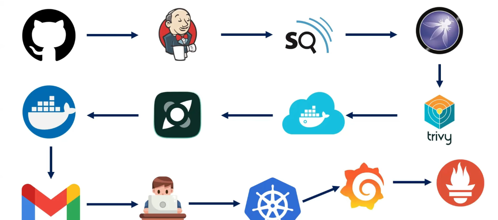

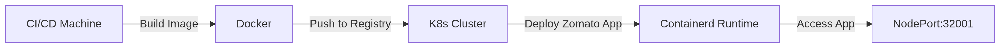

---

## DevOPs-CI/CD Pipeline 

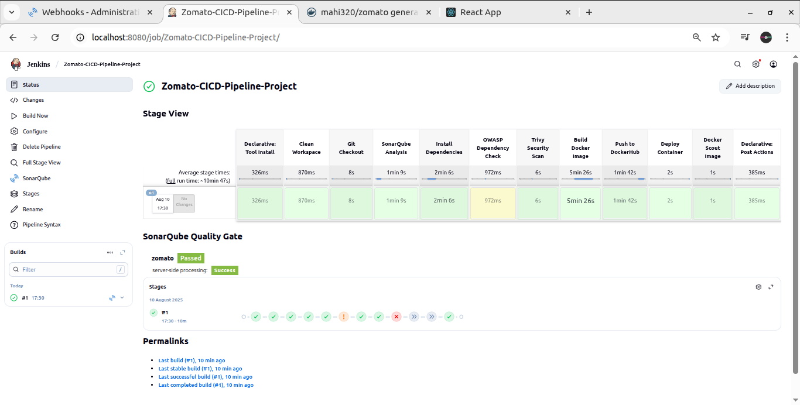
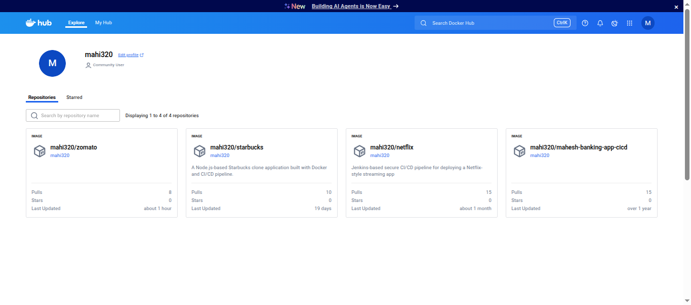
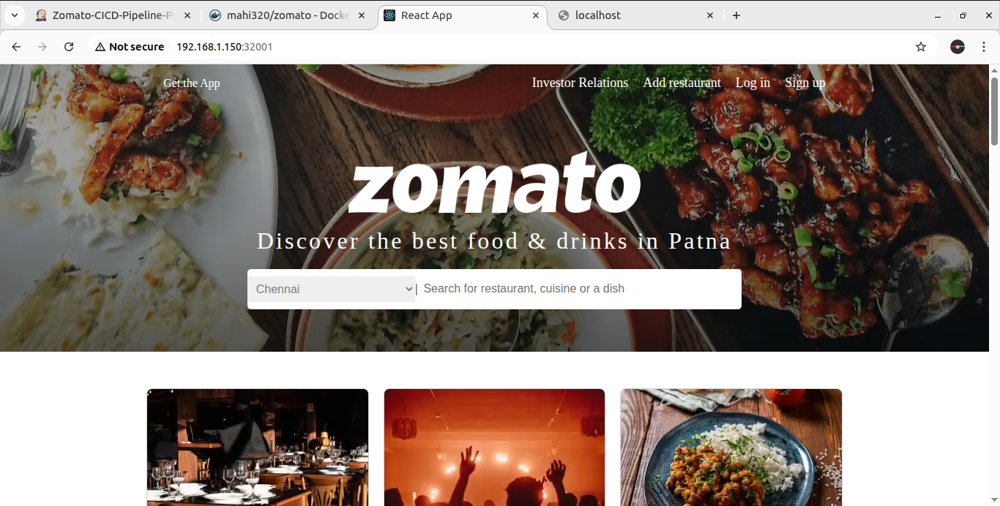

---

## Kubernetes(K8S) and Monitoring

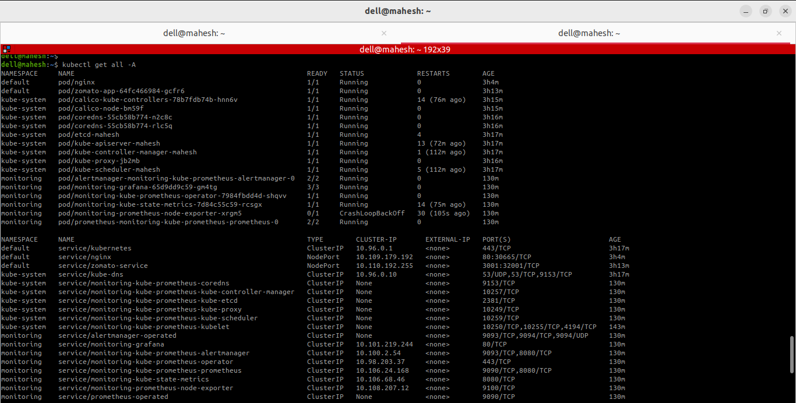
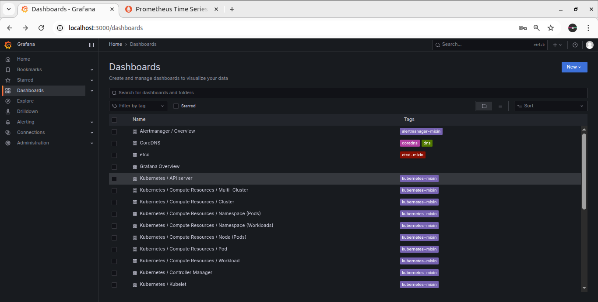
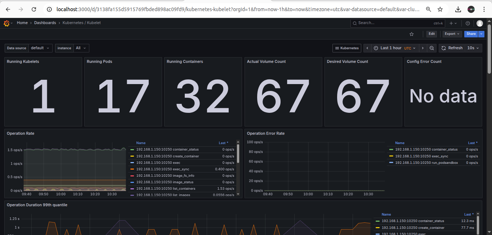
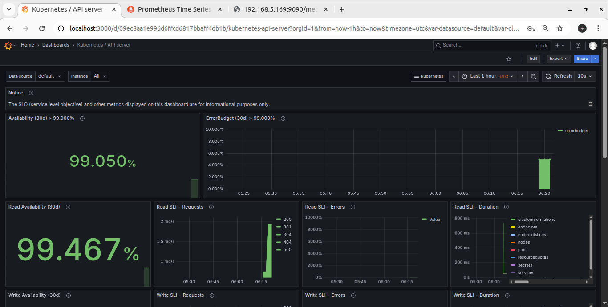
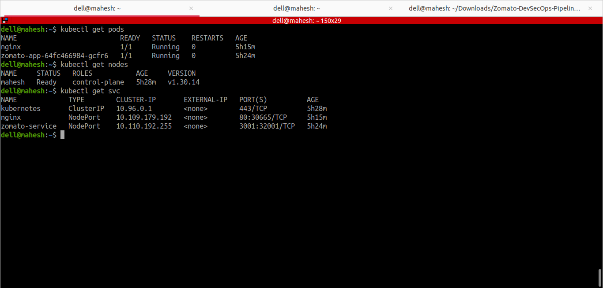
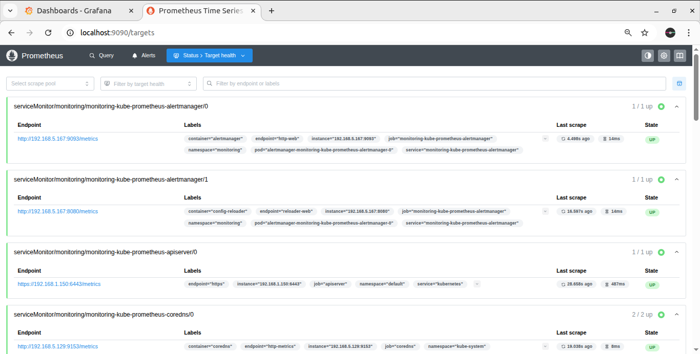

---

### 📹 DevOps Project Video Link:  
[

[

---

## Connect with me

  

---

## Learning made fun! 😊

